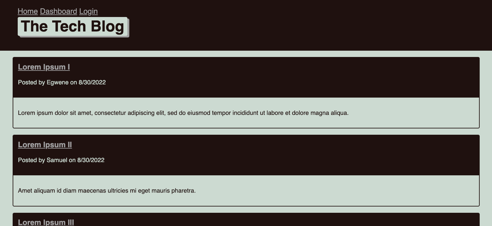

# Tech Blog

## Description

A blog where a developer can write about tech. These posts are on the homepage. The user can login and also create an account.

## Installation

Go to github and clone <a> https://github.com/jlamond37/tech-blog </a>

## Usage

Go to the login page and click on "sign up instead". Enter a username and password and click "signup!". Then, you will be able to create a post by entering a "title" and "content" and clicking on "create". Then the post will be available on the home page. 
